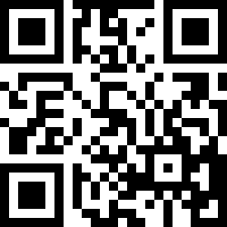

# Nim QR
QR-code package for Nim. Create SVG and Raster Image files with QR-codes from strings.

The code is based on [bunkford's qrcodegen package](https://github.com/bunkford/qrcodegen), which is a wrapper for [nayuki's QR-code](https://github.com/nayuki/QR-Code-generator).


# Install

## Nimble

```
nimble install qr
# and then just `import qr`
```

## Manually
```
git clone https://github.com/ThomasTJdev/nim_qr.git
cd qr
nimble install
# and then just `import qr`
```

# Examples

Generate a SVG file:
```nim
import qr

qrSvgFile("https://forum.nim-lang.org", "test.svg")
# Data:        https://forum.nim-lang.org
# Output file: test.svg
# This uses the standard configuration, e.g. optimal size, mask pattern.
```




Generate a Raster Image file:
```nim
import qr

qrPbmFile("https://forum.nim-lang.org", "test.pbm")
# Data:        https://forum.nim-lang.org
# Output file: test.pbm
# This uses the standard configuration, e.g. optimal size, mask pattern.
```

Tiny program that generates SVG QR Codes from the terminal first argument:

```nim
import os, qr
qrSvgFile paramStr(1), "output.svg"
```

Tiny program that generates Image QR Codes from the terminal first argument:

```nim
import os, qr
qrPbmFile paramStr(1), "output.pbm"
```


# Nim QR package procs

## qrBinary*

```nim
proc qrBinary*(data: string, eccLevel = Ecc_Medium, verMin: cint = VERSION_MIN, verMax: cint = VERSION_MAX, mask = Mask_AUTO): string =
```

This returns 1 (black) and 0's (whites) representing the QR code. Each row is separated by a newline `\n`.


**Example**
```nim
  let qr = qrBinary("Hello world")
  # qr = 1100111101\n101001010\n010101011\n101......
```


____

## qrRow*

```nim
proc qrRow*(data: string, eccLevel = Ecc_Medium, verMin: cint = VERSION_MIN, verMax: cint = VERSION_MAX, mask = Mask_AUTO): seq[seq[int]] =
```

Return a seq[seq[int]] containing the QR-code. 1's is a black field, and 0's is blank field.


**Example**
```nim
  let qr = qrRow("Hello world")
  # qr = @[@[0,1,1,0,1....],@[0,0,1,1,1...],@[0,1,1,1,0...
```


____

## qrSvgFile*

```nim
template qrSvgFile*(data, filename: string, size: int32 = 0, border: cint = 0, eccLevel = Ecc_Medium, verMin: cint = VERSION_MIN, verMax: cint = VERSION_MAX, mask = Mask_AUTO) =
```

Creates a SVG file for the QR and saves it.

The `size` should be in pixels. If set to 0, the optimal size will be used based on the density.

You can set the minimum and maximum size params, `verMin` and `verMax`. You can use values from 1-40.

You only need to define the `data` and a `filename`. Please note there's no error checking when creating the file, you have to that yourself.


**Example**
```nim
  qrSvgFile("Hello world", "test.svg")
```


____

## qrSvg*

```nim
proc qrSvg*(data: string, size: int32 = 0, border: cint = 0, eccLevel = Ecc_Medium, verMin: cint = VERSION_MIN, verMax: cint = VERSION_MAX, mask = Mask_AUTO): string =
```

Returns the SVG data

The `size` should be in pixels. If set to 0, the optimal size will be used based on the density.

You can set the minimum and maximum size params, `verMin` and `verMax`. You can use values from 1-40.

You only need to define the `data`.


**Example**
```nim
  let htmlReadySvg = qrSvg("Hello world")
```


____

## qrPrint*

```nim
proc qrPrint*(data: string, border: cint = 0, eccLevel = Ecc_Medium, verMin: cint = VERSION_MIN, verMax: cint = VERSION_MAX, mask = Mask_AUTO, fgColor = "##", bgColor = "  ") =
```

Prints the QR-code to the console with `"#"`'s.

You can customize the character representing the Black & White colors,

`fgColor` is for Foreground Color, `bgColor` is for Background Color.


**Example**
```nim
  qrPrint("Hello world", fgColor = "⬛", bgColor = "..")
```

____

## qrPbmFile*

```nim
template qrPbmFile*(data, filename: string, eccLevel = Ecc_Medium, verMin: cint = VERSION_MIN, verMax: cint = VERSION_MAX, mask = Mask_AUTO, comment = "") =
```

Creates a PBM file for the QR and saves it. Format is Monochrome (Black & White), but is really lighweight too.

`comment` is metadata string comment, optional.

The `size` should be in pixels. If set to 0, the optimal size will be used based on the density.

You can set the minimum and maximum size params, `verMin` and `verMax`. You can use values from 1-40.

You only need to define the `data` and a `filename`. Please note there's no error checking when creating the file, you have to that yourself.

**Example**
```nim
  qrPbmFile("Hello world", "test.pbm")
```

____


# Const

Version:
```nim
const
  VERSION_MIN* = 1  ## QR Code Minimum Version
  VERSION_MAX* = 40 ## QR Code Maximum Version
```

_____

# Types

## Ecc* = enum

The error correction level in a QR Code symbol. `Ecc_MEDIUM` is used as standard.

* __Ecc_LOW__: The QR Code can tolerate about  7% erroneous codewords

* __Ecc_MEDIUM__: The QR Code can tolerate about 15% erroneous codewords

* __Ecc_QUARTILE__: The QR Code can tolerate about 25% erroneous codewords

* __Ecc_HIGH__: The QR Code can tolerate about 30% erroneous codewords
```nim
  Ecc* {.size: sizeof(cint).} = enum
    Ecc_LOW = 0,
    Ecc_MEDIUM,
    Ecc_QUARTILE,
    Ecc_HIGH
```

____

## Mask* = enum

 The mask pattern used in a QR Code symbol. Mask_AUTO is used as standard.

* __Mask_AUTO__: A special value to tell the QR Code encoder to automatically select an appropriate mask pattern

* __Mask_0 = 0, Mask_1, Mask_2, Mask_3, Mask_4, Mask_5, Mask_6, Mask_7__: The eight actual mask patterns
```nim
  Mask* {.size: sizeof(cint).} = enum
    Mask_AUTO = -1,
    Mask_0 = 0, Mask_1, Mask_2, Mask_3, Mask_4, Mask_5, Mask_6, Mask_7
```

____


# Wrapped from C


The text below is a direct copy'n'paste from [bunkford's qrcodegen package](https://github.com/bunkford/qrcodegen), which is a wrapper for [nayuki's QR-code](https://github.com/nayuki/QR-Code-generator). Therefore, thanks to nayuki for the detailed description.

All the _items_ are available, but please keep in mind, that they use `ptr uint8`, `cint`, `cstring`, etc.


# Object

## Segment* {.bycopy.} = object

A segment of character/binary/control data in a QR Code symbol. The mid-level way to create a segment is to take the payload data and call a factory function such as makeNumeric().

The low-level way to create a segment is to custom-make the bit buffer and initialize a Segment struct with appropriate values. Even in the most favorable conditions, a QR Code can only hold 7089 characters of data. Any segment longer than this is meaningless for the purpose of generating QR Codes.

Moreover, the maximum allowed bit length is 32767 because the largest QR Code (version 40) has 31329 modules.

* __mode*: Mode__: The mode indicator of this segment. The length of this segment's unencoded data. Measured in characters for numeric/alphanumeric/kanji mode, bytes for byte mode, and 0 for ECI mode. Always zero or positive. Not the same as the data's bit length.

* __numChars*: cint__: The data bits of this segment, packed in bitwise big endian. Can be null if the bit length is zero.

* __data*: ptr uint8__: The number of valid data bits used in the buffer. Requires 0 <= bitLength <= 32767, and bitLength <= (capacity of data array) * 8. The character count (numChars) must agree with the mode and the bit buffer length.
```nim
  Segment* {.bycopy.} = object
    mode*: Mode
    numChars*: cint
    data*: ptr uint8
    bitLength*: cint
```

____


# Procs

## encodeText*

```nim
proc encodeText*(text: cstring; tempBuffer: ptr uint8; qrcode: ptr uint8; ecl: Ecc; minVersion: cint; maxVersion: cint; mask: Mask; boostEcl: bool): bool {.cdecl, importc: "qrcodegen_encodeText", dynlib: libname.}
```

Encodes the given text string to a QR Code, returning true if encoding succeeded. If the data is too long to fit in any version in the given range at the given ECC level, then false is returned.
- The input text must be encoded in UTF-8 and contain no NULs.
- The variables ecl and mask must correspond to enum constant values.
- Requires 1 <= minVersion <= maxVersion <= 40.
- The arrays tempBuffer and qrcode must each have a length of at least BUFFER_LEN_FOR_VERSION(maxVersion). - After the function returns, tempBuffer contains no useful data.
- If successful, the resulting QR Code may use numeric, alphanumeric, or byte mode to encode the text.
- In the most optimistic case, a QR Code at version 40 with low ECC can hold any UTF-8 string up to 2953 bytes, or any alphanumeric string up to 4296 characters, or any digit string up to 7089 characters. These numbers represent the hard upper limit of the QR Code standard.
- Please consult the QR Code specification for information on data capacities per version, ECC level, and text encoding mode.


____

## encodeBinary*

```nim
proc encodeBinary*(dataAndTemp: ptr uint8; dataLen: csize; qrcode: ptr uint8; ecl: Ecc; minVersion: cint; maxVersion: cint; mask: Mask; boostEcl: bool): bool {.cdecl, importc: "qrcodegen_encodeBinary", dynlib: libname.}
```

Encodes the given binary data to a QR Code, returning true if encoding succeeded. If the data is too long to fit in any version in the given range at the given ECC level, then false is returned.
- The input array range dataAndTemp[0 : dataLen] should normally be valid UTF-8 text, but is not required by the QR Code standard.
- The variables ecl and mask must correspond to enum constant values.
- Requires 1 <= minVersion <= maxVersion <= 40.
- The arrays dataAndTemp and qrcode must each have a length of at least BUFFER_LEN_FOR_VERSION(maxVersion).
- After the function returns, the contents of dataAndTemp may have changed, and does not represent useful data anymore.
- If successful, the resulting QR Code will use byte mode to encode the data.
- In the most optimistic case, a QR Code at version 40 with low ECC can hold any byte sequence up to length 2953. This is the hard upper limit of the QR Code standard.
- Please consult the QR Code specification for information on data capacities per version, ECC level, and text encoding mode.


____

## encodeSegments*

```nim
proc encodeSegments*(segs: ptr Segment; len: csize; ecl: Ecc; tempBuffer: ptr uint8; qrcode: ptr uint8): bool {.cdecl, importc: "qrcodegen_encodeSegments", dynlib: libname.}
```

Renders a QR Code representing the given segments at the given error correction level.

The smallest possible QR Code version is automatically chosen for the output. Returns true if QR Code creation succeeded, or false if the data is too long to fit in any version.
The ECC level of the result may be higher than the ecl argument if it can be done without increasing the version.

This function allows the user to create a custom sequence of segments that switches between modes (such as alphanumeric and byte) to encode text in less space.

This is a low-level API; the high-level API is encodeText() and encodeBinary().

To save memory, the segments' data buffers can alias/overlap tempBuffer, and will result in them being clobbered, but the QR Code output will still be correct. But the qrcode array must not overlap tempBuffer or any segment's data buffer.


____

## encodeSegmentsAdvanced*

```nim
proc encodeSegmentsAdvanced*(segs: ptr Segment; len: csize; ecl: Ecc; minVersion: cint; maxVersion: cint; mask: Mask; boostEcl: bool; tempBuffer: ptr uint8; qrcode: ptr uint8): bool {. cdecl, importc: "qrcodegen_encodeSegmentsAdvanced", dynlib: libname.}
```

Renders a QR Code representing the given segments with the given encoding parameters.

Returns true if QR Code creation succeeded, or false if the data is too long to fit in the range of versions.

The smallest possible QR Code version within the given range is automatically chosen for the output. Iff boostEcl is true, then the ECC level of the result may be higher than the ecl argument if it can be done without increasing the version. The mask is either between Mask_0 to 7 to force that mask, or Mask_AUTO to automatically choose an appropriate mask (which may be slow).

This function allows the user to create a custom sequence of segments that switches between modes (such as alphanumeric and byte) to encode text in less space.

This is a low-level API; the high-level API is encodeText() and encodeBinary(). To save memory, the segments' data buffers can alias/overlap tempBuffer, and will result in them being clobbered, but the QR Code output will still be correct. But the qrcode array must not overlap tempBuffer or any segment's data buffer.


____

## isAlphanumeric*

```nim
proc isAlphanumeric*(text: cstring): bool {.cdecl, importc: "qrcodegen_isAlphanumeric", dynlib: libname.}
```

Tests whether the given string can be encoded as a segment in alphanumeric mode. A string is encodable iff each character is in the following set: 0 to 9, A to Z (uppercase only), space, dollar, percent, asterisk, plus, hyphen, period, slash, colon.


____

## isNumeric*

```nim
proc isNumeric*(text: cstring): bool {.cdecl, importc: "qrcodegen_isNumeric", dynlib: libname.}
```

Tests whether the given string can be encoded as a segment in numeric mode. A string is encodable iff each character is in the range 0 to 9.


____

## calcSegmentBufferSize*

```nim
proc calcSegmentBufferSize*(mode: Mode; numChars: csize): csize {.cdecl, importc: "qrcodegen_calcSegmentBufferSize", dynlib: libname.}
```

Returns the number of bytes (uint8) needed for the data buffer of a segment containing the given number of characters using the given mode. Notes:
- Returns SIZE_MAX on failure, i.e. numChars > INT16_MAX or the number of needed bits exceeds INT16_MAX (i.e. 32767).
- Otherwise, all valid results are in the range [0, ceil(INT16_MAX / 8)], i.e. at most 4096. - It is okay for the user to allocate more bytes for the buffer than needed.
- For byte mode, numChars measures the number of bytes, not Unicode code points.
- For ECI mode, numChars must be 0, and the worst-case number of bytes is returned. An actual ECI segment can have shorter data. For non-ECI modes, the result is exact.


____

## makeBytes*

```nim
proc makeBytes*(data: ptr uint8; len: csize; buf: ptr uint8): Segment {.cdecl, importc: "qrcodegen_makeBytes", dynlib: libname.}
```

Returns a segment representing the given binary data encoded in byte mode. All input byte arrays are acceptable. Any text string can be converted to UTF-8 bytes and encoded as a byte mode segment.


____

## makeNumeric*

```nim
proc makeNumeric*(digits: cstring; buf: ptr uint8): Segment {.cdecl, importc: "qrcodegen_makeNumeric", dynlib: libname.}
```

Returns a segment representing the given string of decimal digits encoded in numeric mode.


____

## makeAlphanumeric*

```nim
proc makeAlphanumeric*(text: cstring; buf: ptr uint8): Segment {.cdecl, importc: "qrcodegen_makeAlphanumeric", dynlib: libname.}
```

Returns a segment representing the given text string encoded in alphanumeric mode. The characters allowed are: 0 to 9, A to Z (uppercase only), space, dollar, percent, asterisk, plus, hyphen, period, slash, colon.


____

## makeEci*

```nim
proc makeEci*(assignVal: clong; buf: ptr uint8): Segment {.cdecl, importc: "qrcodegen_makeEci", dynlib: libname.}
```

Returns a segment representing an Extended Channel Interpretation (ECI) designator with the given assignment value.


____

## getSize*

```nim
proc getSize*(qrcode: ptr uint8): cint {.cdecl, importc: "qrcodegen_getSize", dynlib: libname.}
```

Returns the side length of the given QR Code, assuming that encoding succeeded. The result is in the range [21, 177]. Note that the length of the array buffer is related to the side length - every 'uint8 qrcode[]' must have length at least BUFFER_LEN_FOR_VERSION(version), which equals ceil(size^2 / 8 + 1).


____

## getModule*

```nim
proc getModule*(qrcode: ptr uint8; x: cint; y: cint): bool {.cdecl, importc: "qrcodegen_getModule", dynlib: libname.}
```

Returns the color of the module (pixel) at the given coordinates, which is false for white or true for black. The top left corner has the coordinates (x=0, y=0). If the given coordinates are out of bounds, then false (white) is returned.

____

Readme generated with [NimToMd](https://github.com/ThomasTJdev/nimtomd)